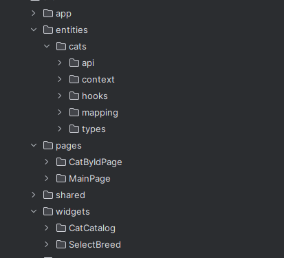

# Chosen Technologies

Since working with client websites requires the developer to work not with his favorite stack, but with the stack on which the client's website is written, I used only those technologies that were listed in Required skills.
Therefore, the build from Create React App (Typescript), React Router Dom, React Context, and React Bootstrap was used.

For API requests, the combination of Axios + React Query was chosen. 

Since React Query can handle errors, loading, and caching requests out of the box.

Scss was chosen as the design system, as it is the most versatile.

In one place, I added inline css to fix the image size so it doesn't jump during loading.

```tsx
<Card.Img
    alt={CAT_IMG_ALT_TEXT}
    style={{
        aspectRatio: `${cat.width}/${cat.height}`,
    }}
    variant=" top"
    src={cat.url}
/>
```

# File System design
For the file system, I chose FSD: https://feature-sliced.design/
Because I consider it the most convenient and well-thought-out system to date and use it even in small projects.

The benefits I gained:
All global files are in the app folder. Everything related to the entire application is stored there (global styles, routes, etc.). There is no need to create separate folders for them.
The entities folder is my favorite. It stores the entities that we operate with in the project (and usually request from the database). We have one cat entity, but it is used both in the catalog and on a separate page, and the breeds are listed in Select. So where to store types for this? Or mapping functions for different conditions. All this can be stored in entities.

All components contain their own tests, styles. In this way, minimal coupling and maximum reusability are achieved.




# Tests

Tests are run using the standard `npm test` command.
I covered almost all the functionality with tests, checked the API interaction, and handled border values.
It might seem that a lot of constants are used in the code, but they are for tests - to easily find elements on the page. And when the text changes, the search for elements in the test also changes.

# Comments in the code

I try to write clear code so that I don't have to comment a lot. Therefore, comments are only in functionality that seems non-obvious.
Or it's unclear why it is used in the element. For example, handling the "Back" button from the Cat page to the main page. Or that duplicates can come from the API.

```tsx
useEffect(() => {
    // if we came from CatByIdPage with "Back" btn, we need to set selected breed
    if (!context) return;
    const breedId = location.state?.breedId;

    if (breedId && data) {
        const { setSelectedBreed } = context;
        setSelectedBreed(breedId);

        // remove breedId from location state
        const newState = { ...location.state };
        delete newState.breedId;
        navigate(location.pathname, { state: newState, replace: true });
    }
}, [data]);
```

# How to start the project

Start exploring the project with Home.txt in the pages folder. 
I hope you appreciate the simplicity and component structure.

```tsx
function Home() {
    return (
        <Container className="page">
            <h1>Cat Browser</h1>
            <SelectBreed />
            <CatCatalog />
        </Container>
    );
}
```

In the project directory, you can run:

### `npm start`

Runs the app in the development mode.\
Open [http://localhost:3000](http://localhost:3000) to view it in the browser.

The page will reload if you make edits.\
You will also see any lint errors in the console.

### `npm test`

Launches the test runner in the interactive watch mode.\
See the section about [running tests](https://facebook.github.io/create-react-app/docs/running-tests) for more information.

## Learn More

You can learn more in the [Create React Home documentation](https://facebook.github.io/create-react-app/docs/getting-started).

To learn React, check out the [React documentation](https://reactjs.org/).
